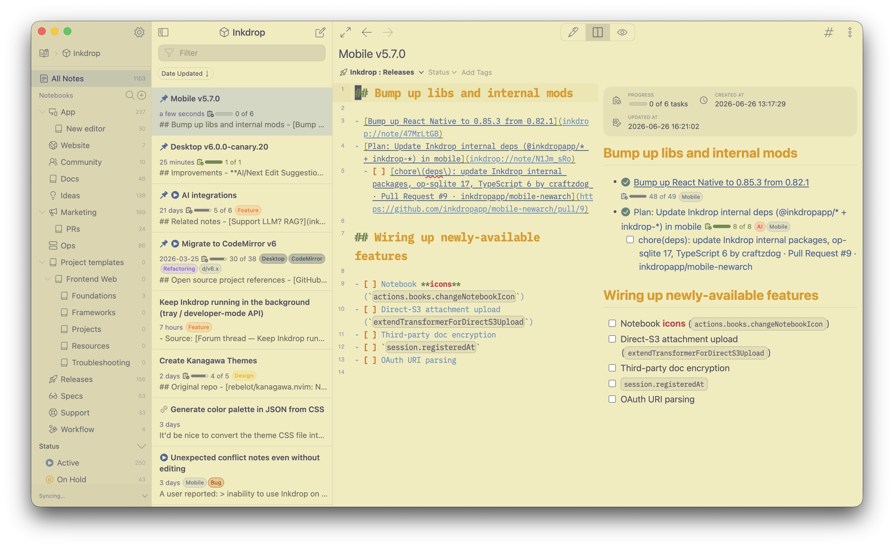

# kanagawa-lotus-syntax

Kanagawa Lotus syntax theme for Inkdrop Markdown Editor.
The color palette is based on [rebelot/kanagawa.nvim](https://github.com/rebelot/kanagawa.nvim) — a dark colorscheme inspired by the colors of the famous painting by Katsushika Hokusai.



## Installation

```sh
ipm install kanagawa-lotus-syntax
```
